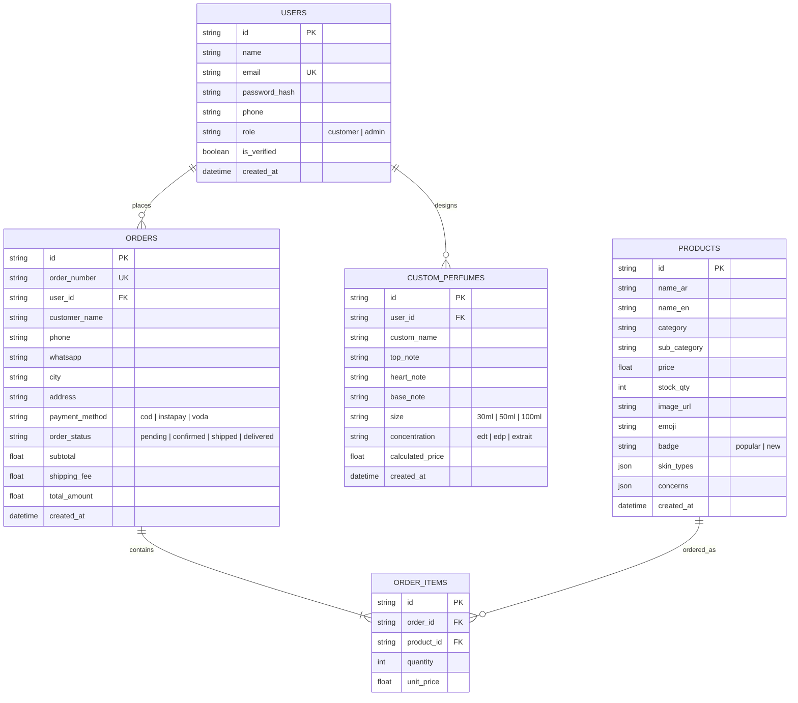

# 📋 وثيقة تسليم المشروع لمطور الباك إند (Backend Developer Handover Guide)
### متجر لمسة (LAMSA) — عطور فاخرة وعناية متكاملة
**رابط المستودع:** `https://github.com/ghanem442/lamsa-website`  
**التقنية المستخدمة في الفرونت إند:** HTML5, CSS3 (Modern Variables, Flexbox/Grid), Vanilla JavaScript (No Frameworks).

---

## 📌 1. نظرة عامة على تدفق المستخدم (User Journey & Architecture)

الموقع مصمم بنظام SPA-like خفيف بدون أطر عمل، ويعتمد حالياً على محاكاة البيانات في `localStorage` و `sessionStorage`. مهمة الباك إند هي استبدال هذه التخزينات المؤقتة بقواعد بيانات حقيقية وواجهات برمجية (RESTful APIs أو GraphQL).

### مسار العميل الأساسي:
1. **صفحة الدخول / التسجيل (`auth.html`)**:
   - العميل يبدأ منها لتسجيل الدخول أو إنشاء حساب جديد.
   - يدعم التسجيل العادي (الاسم، البريد، كلمة المرور) + التحقق بالرمز (OTP).
   - يدعم زر Google OAuth.
   - يدعم الدخول كـ "زائر (Guest)" لتصفح المتجر بحرية.
   - حساب الأدمن المخصص: `admin@lamsa.com` / `Lamsa@2026` يوجه تلقائياً إلى لوحة الإدارة (`admin.html`).

2. **الانترو السينمائي (`intro.html`)**:
   - شاشة ترحيبية بالهوية الفاخرة، تنتقل عند النقر إلى المتجر الرئيسي (`index.html`).

3. **المتجر والصفحات الرئيسية (`index.html`, `shop.html`, `routine.html`, `gift.html`, `perfume.html`)**:
   - تصفح المنتجات، إضافة للسلة، تجربة صانع العطور، اختبار الروتين الذكي.
   - **نظام الحماية (Auth Guard)**: يستطيع الزائر تصفح كل شيء بحرية، لكن عند الرغبة في إتمام الطلب (`Checkout` أو `WhatsApp Order`)، يوقفه النظام ويطلب منه تسجيل الدخول/التحقق، مع تذكر الصفحة التي كان يشتري منها (`returnUrl`).

---

## 🗂️ 2. تفصيل صفحات الموقع ووظائفها الفنية

### ① صفحة تسجيل الدخول والتحقق (`auth.html`)
- **الوظيفة:**
  - تبويب **تسجيل الدخول (Login)**: إرسال البريد وكلمة المرور للتحقق.
  - تبويب **حساب جديد (Sign Up)**: يطلب (الاسم، البريد، كلمة المرور)، ثم يفتح شاشة إدخال رمز التحقق **OTP** المكون من 4 أرقام.
  - زر **Google Login**: جاهز للربط مع Google Identity Services / OAuth 2.0.
  - زر **تخطي كزائر**: يحفظ حالة مؤقتة وينقل للواجهة العامة.
- **مطلوب من الباك إند:**
  - `POST /api/auth/register` (إنشاء حساب + توليد وإرسال رمز OTP إلى البريد الإلكتروني عبر خدمة مثل Brevo/Resend/SMTP).
  - `POST /api/auth/verify-otp` (التحقق من الكود وتفعيل الحساب).
  - `POST /api/auth/login` (التحقق وإصدار JWT Token أو Session Cookie).
  - `POST /api/auth/google` (استلام Google Token والتحقق منه وحفظ المستخدم).
  - `GET /api/auth/me` (استرجاع بيانات المستخدم الحالي وصلاحيته: `customer` أو `admin`).

---

### ② الصفحة الرئيسية (`index.html`)
- **الوظيفة:**
  - Hero Section فاخر باللون العنابي والذهبي والوضع الليلي الدائم.
  - 3 كروت خدمات رئيسية:
    1. **اختارلي روتين** ➔ يوجه إلى `routine.html`.
    2. **صمم هديتك** ➔ يوجه إلى `gift.html`.
    3. **اعمل برفانك** ➔ يوجه إلى `perfume.html`.
  - مختارات لمسة (Curated Picks): تعرض تلقائياً المنتجات ذات الوسم `popular` أو `new`.
  - مميزات المتجر وآراء العملاء.
- **مطلوب من الباك إند:**
  - `GET /api/products/featured` لجلب المنتجات المميزة ديناميكياً بدلاً من `data.js`.

---

### ③ المتجر والكاتالوج (`shop.html`)
- **الوظيفة:**
  - تصفية المنتجات حسب الفئات الأساسية: (بشرة `skin`، شعر `hair`، جسم `body`، عطور `perfumes`، مزيلات عرق `deodorant`، مكياج `makeup`).
  - تصفية فرعية (Sub-categories) مثل: غسول، سيروم، شامبو، مرطب... إلخ.
  - بحث فوري بالاسم العربي والإنجليزي.
  - ترتيب حسب السعر (من الأقل للأعلى / من الأعلى للأقل).
  - نافذة العرض السريع (Quick View Modal) بالأسعار والتفاصيل.
  - إضافة للسلة وحفظها في `localStorage` (أو ربطها بحساب المستخدم في الداتابيز).
- **مطلوب من الباك إند:**
  - `GET /api/products?category=...&subCategory=...&search=...&sort=...` مع دعم Pagination.

---

### ④ مُختبر صناعة العطور التفاعلي (`perfume.html`)
- **الوظيفة:**
  - زجاجة عطر 3D تفاعلية يتغير لون السائل والعطر بداخلها فيزيائياً حسب النوتات المختارة.
  - حفر اسم العميل بماء الذهب مباشرة على الزجاجة (`Live Engraving`).
  - الهرم العطري الثلاثي:
    * **افتتاحية العطر (Top Notes):** برغموت، لافندر، هيل، توت، نسيم البحر.
    * **قلب العطر (Heart Notes):** ياسمين، باتشولي، عنبر، قرفة، فانيليا.
    * **قاعدة العطر (Base Notes):** عود ملكي، مسك أبيض، خشب الصندل، توباكو، جلد فاخر.
  - رادار القياس الحي: يحسب تلقائياً الثبات (Longevity)، الفوحان (Sillage)، والطابع (Vibe).
  - مصفوفة الأحجام والتركيزات: 30ml / 50ml / 100ml بتركيزات (EDT, EDP, Extrait de Parfum).
  - إرسال تفاصيل وصفة العطر لطلبها فوراً عبر واتساب المتجر (`201080239612`).
- **مطلوب من الباك إند:**
  - جدول مخصص لتخزين تركيبات العطور المصنوعة (`custom_perfumes`).
  - `POST /api/perfumes/custom` لحفظ الوصفة وربطها برقم طلب محدد للعميل.
  - `GET /api/perfumes/pricing` لجلب مصفوفة الأسعار المعتمدة من الأدمن.

---

### ⑤ اختبار اختيار الروتين الذكي (`routine.html`)
- **الوظيفة:**
  - كويز من 4 أسئلة:
    1. نوع البشرة (جافة، دهنية، مختلطة، حساسة).
    2. نوع الشعر (جاف، دهني، تالف، عادي).
    3. المشاكل الأساسية (حب شباب، تصبغات، تساقط...).
    4. الميزانية (اقتصادي، متوسط، بريميوم).
  - لوجيك خوارزمية يحلل الإجابات ويقترح 3 لـ 5 منتجات متناسقة من مخزون المتجر مع إمكانية إضافة الباقة كاملة للسلة بضغطة زر.
- **مطلوب من الباك إند:**
  - `POST /api/routine/recommend` (اختياري: لتطوير ذكاء التوصية في المستقبل أو تسجيل اهتمامات العملاء للـ Marketing).

---

### ⑥ معالج تصميم الهدايا (`gift.html`)
- **الوظيفة:**
  - معالج من 3 خطوات لاختيار (المُهدى إليه، المناسبة، الميزانية).
  - توليد باقة هدايا فاخرة مع كارت إهداء وتغليف شيك.
  - إمكانية طلب الباقة عبر واتساب أو السلة.

---

### ⑦ سلة المشتريات وإتمام الطلب (`js/main.js` Modal)
- **الوظيفة:**
  - سلة جانبية منزلقة تعرض المنتجات مع الكميات والأسعار والإجمالي.
  - نافذة الدفع والشحن (`openCheckoutModal`):
    * جمع بيانات الشحن: (الاسم، الهاتف، واتساب، المحافظة، المنطقة، العنوان التفصيلي).
    * طرق الدفع: كاش عند الاستلام (COD)، إنستاباي (InstaPay)، فودافون كاش.
    * احتساب مصاريف الشحن الافتراضية (35 ج.م).
    * توليد رقم طلب فريد بصيغة: `LMS-XXXXXX`.
    * فتح رسالة مفصلة بفاتورة الطلب على واتساب المتجر.
- **مطلوب من الباك إند:**
  - `POST /api/orders` لإنشاء وتخزين الطلب وحالته (`pending`, `confirmed`, `shipped`, `delivered`).
  - `GET /api/orders/:id` للاستعلام عن الطلب.
  - ربط بوابات دفع إلكترونية مستقبلاً (Paymob / Fawry / Kashier).

---

### ⑧ لوحة التحكم والإدارة (`admin.html`)
- **الوظيفة:**
  - **الحماية:** محمية بـ Auth Guard من الفرونت إند ومربوطة بـ `admin@lamsa.com`.
  - **إدارة المنتجات:** إضافة، تعديل، حذف، رفع صور أو أيقونات للمنتجات.
  - **استوديو العطور:** تحرير مصفوفة أسعار زجاجات العطور (30ml, 50ml, 100ml) والتركيزات.
  - **تصدير واستيراد البيانات:** تدعم التصدير والاستيراد لملفات CSV والإكسيل.
- **مطلوب من الباك إند:**
  - تأمين كل مسارات الأدمن عبر Middleware يتأكد من `role === 'admin'`.
  - `CRUD /api/admin/products`
  - `GET / PUT /api/admin/settings/perfume-matrix`
  - `GET /api/admin/orders` لمتابعة وتحديث حالات طلبات الزبائن.

---

## 💾 3. المخطط المقترح لقاعدة البيانات (Database Schema Overview)

---

## ⚙️ 4. المتغيرات والبيانات الثابتة للمتجر (Constant Configuration)

- **اسم المتجر:** لمسة (LAMSA)
- **المقر:** الإسكندرية، عزبة محسن، شارع نمرة 9
- **رقم الواتساب الرسمي:** `+201080239612` (صيغة الربط: `wa.me/201080239612`)
- **ساعات العمل:** يومياً من 11:00 صباحاً حتى 1:00 بعد منتصف الليل
- **وسائل التواصل:**
  - فيسبوك: `https://www.facebook.com/share/1CKEaEaqRF/`
  - إنستجرام: `https://www.instagram.com/lamsastore00`
  - تيك توك: `https://www.tiktok.com/@lamsastore03`
  - قناة واتساب: `https://whatsapp.com/channel/0029Vb8wEA80bIde3x07Om1p`
